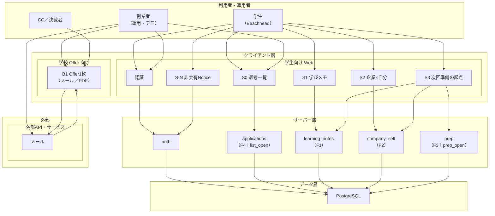
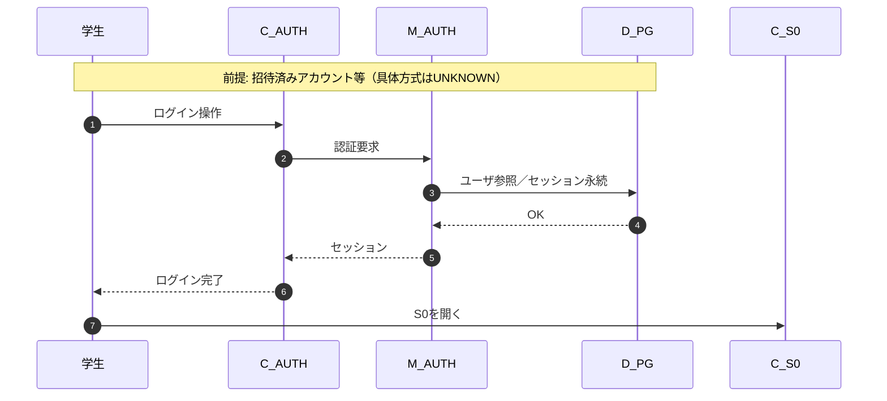
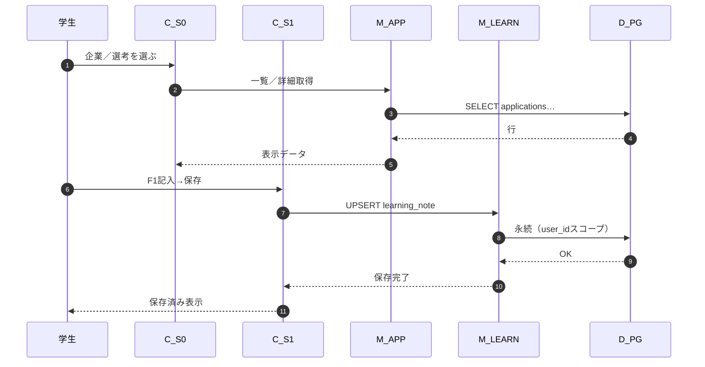
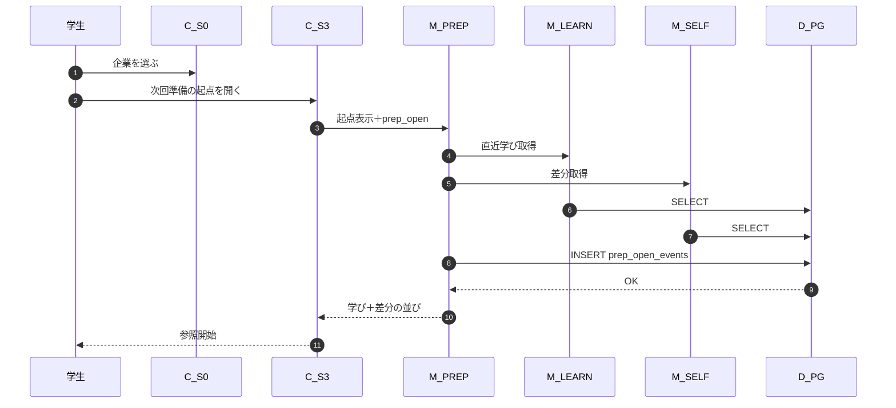
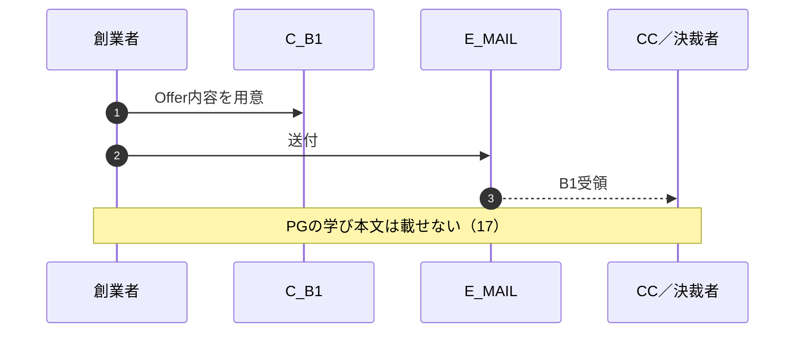

# Arch Spec (システム構成)

> **状態: LOCKED** — 2026-08-21（再LOCK）。**Inventory→Edges→mermaid**。**B＝実装先行**。**Notionは自社スタック非採用**。Client＝S0–S3／S-N／B1。Server＝Mustドメイン＋auth。主DB＝PostgreSQL。ExtDevices＝なし。

## 🎯 このドキュメントの結論

> **配置**: Users（学生／創業者／CC）＋ **Client（学生Web面＋Offer面）** ＋ **Server（auth／applications／learning／company_self／prep）** ＋ **Data（PostgreSQLのみ）** ＋ ExtApis（**メールのみ**）。[INFERENCE]
>
> **通信**: 学生コアは `面 → モジュール → PG`。**Client→PG直は禁止**。学校／CCから PG 本文への矢印は描かない。[FACT]（21/17）
>
> **Arch Spec**: ⚠️ **WARNING** — 境界はMustに対応。認証製品名・HA／マルチ環境は未定義でよい。[UNKNOWN]（認証具体）

> [!WARNING]
> 箱がある ≠ 検証済み。11/14/15を22で飛ばすな。録音／AI／学校本文ポータルを復活させない。

> [!IMPORTANT]
> Arch Spec ≠ 事業成功。判定の正は13/14/15。

---

## 💡 Executive 洞察（最大2）

1. **Serverを「最小API」1箱にしない** — F4/F1/F2/F3＋authは実装境界が違う。見積・認可・イベント配線を誤らないためにモジュール分割する。[INFERENCE]
2. **CCはDataに届かない** — B1は Offer 面（メール／PDF）。学生本文の閲覧経路を図に作らない。[INFERENCE]（17）

---

## 🚪 入口判定

| 項目 | 内容 | ラベル |
| ---- | ---- | ------ |
| 配置が実装に必要か | **Yes**（21＝Web＋API＋PG） | [FACT]（方針） |
| 21 主DB | **PostgreSQL 採用** | [FACT] |
| 今回なしの層／子 | **ExtDevices**。**Notion（自社非採用）**。キャッシュ／オブジェクトストレージ | [FACT]（決裁）／[INFERENCE] |
| 深さ | **通常22**（Inventory→Edges） | [INFERENCE] |

---

## 📌 引用（＋13/20/21との判定関係）

| 出典 | 要約 | 22での扱い |
| ---- | ---- | ---------- |
| **21** LOCKED | Web→API→PG。AI／録音／Client→PG直なし。**Notion採用なし** | 配置対象。復活させない |
| **13** LOCKED | Must＝F4+F1–F3。V1–V3計測。実験形＝Web+PG | 箱・シーケンスの正 |
| **20** LOCKED | S0–S3／S-N／B1。F-A〜F-D | 面ノード・通信の入力 |
| **17** LOCKED | 非共有・学校に本文出さない | 禁止矢印 |
| **23** LOCKED | applications／notes／events 等 | 配置の参照のみ（カラムは23） |

| 章 | 役割 |
| -- | ---- |
| **13** | Must |
| **20** | 面・キーフロー |
| **21** | 採用／捨てる |
| **22** | Arch Spec 下位・配置・通信 |
| 誤帰属禁止 | 配置不足 alone で Problem／Must を殺さない |

---

## 🏗️ 全体アーキテクチャ

### Inventory（図の前）

| ID | 層 | 区分（子） | ノード名 | 出典 | MVP | ラベル |
| -- | -- | ---------- | -------- | ---- | --- | ------ |
| U_S | Users | — | 学生（Beachhead） | 10/13/20 | ✅ | [FACT]（方針） |
| U_F | Users | — | 創業者（運用・デモ） | 18/15 | ✅ | [INFERENCE] |
| U_C | Users | — | CC／決裁者 | 14/15/20 | ✅ | [FACT]（14） |
| C_AUTH | Client | 学生向け | 認証（ログイン／セッション開始） | 21 | ✅ | [HYPOTHESIS] |
| C_S0 | Client | 学生向け | S0 選考一覧 | 20/13 F4 | ✅ | [HYPOTHESIS] |
| C_S1 | Client | 学生向け | S1 学びメモ | 20/13 F1 | ✅ | [HYPOTHESIS] |
| C_S2 | Client | 学生向け | S2 企業×自分 | 20/13 F2 | ✅ | [HYPOTHESIS] |
| C_S3 | Client | 学生向け | S3 次回準備の起点 | 20/13 F3 | ✅ | [HYPOTHESIS] |
| C_SN | Client | 学生向け | S-N 非共有Notice | 20/17 | ✅ | [HYPOTHESIS] |
| C_B1 | Client | 学校Offer向け | B1 CC Offer1枚（メール／PDF） | 20/14 | ✅ | [FACT]（14） |
| M_AUTH | Server | — | auth（セッション／魔法リンク等） | 21 | ✅ | [UNKNOWN]（製品名） |
| M_APP | Server | — | applications（F4 CRUD＋list_open） | 13/23 | ✅ | [INFERENCE] |
| M_LEARN | Server | — | learning_notes（F1 CRUD） | 13/23 | ✅ | [INFERENCE] |
| M_SELF | Server | — | company_self（F2／user_companies） | 13/23 | ✅ | [INFERENCE] |
| M_PREP | Server | — | prep（F3読取＋prep_open） | 13/23 | ✅ | [INFERENCE] |
| D_PG | Data | — | PostgreSQL（主DB） | 21 | ✅ | [FACT] |
| E_MAIL | External | ExtApis | メール（Offer／通知） | 21 | ✅ | [HYPOTHESIS] |

**描かない（意図的）**: ExtDevices、**Notion**、キャッシュ、録音／AI、学校本文閲覧ポータル、Client→PG。

### Edges

| from | to | 意味 | 出典 |
| ---- | -- | ---- | ---- |
| U_S | C_AUTH | 利用 | 21 |
| U_S | C_S0 & C_S1 & C_S2 & C_S3 & C_SN | 利用 | 20 |
| U_F | C_AUTH & C_S0 | デモ／オンボ（学生面を操作しうる） | 18 |
| U_F | C_B1 | Offer作成・送付起点 | 15 |
| U_F | E_MAIL | Offer送付操作 | 21 |
| U_C | C_B1 | Offer受領 | 20/14 |
| C_AUTH | M_AUTH | 呼出 | 21 |
| C_SN | M_AUTH | 同意記録の前提（実装時はauth／users側） | 17/21 |
| C_S0 | M_APP | 呼出 | 20/13 |
| C_S1 | M_LEARN | 呼出 | 20/13 |
| C_S2 | M_SELF | 呼出 | 20/13 |
| C_S3 | M_PREP & M_LEARN & M_SELF | 呼出（起点表示に学び／差分を読む） | 20/13 |
| C_B1 | E_MAIL | 配信（アプリ本体CRUDではない） | 21 |
| M_AUTH & M_APP & M_LEARN & M_SELF & M_PREP | D_PG | 永続 | 21 |
| E_MAIL | C_B1 | 受領先としての面 | 20 |

### mermaid（Inventory／Edges から生成）

**禁止矢印（明示）**: `U_C → D_PG`、`C_* → D_PG`、学校ロール→本文テーブル、録音デバイス→Server。

---

## 📋 コンポーネント責務

| 層 | 区分 | コンポーネント | 責務 | MVP | 出典 | ラベル |
| -- | ---- | -------------- | ---- | --- | ---- | ------ |
| Users | — | 学生 | V1–V3の行動主体 | ✅ | 10/13 | [FACT] |
| Users | — | 創業者 | オンボ・デモ・Offer送付 | ✅ | 18 | [INFERENCE] |
| Users | — | CC／決裁者 | B1受領・会議／発注判断（本文閲覧なし） | ✅ | 14 | [FACT] |
| Client | 学生向け | 認証 | ログイン開始 | ✅ | 21 | [HYPOTHESIS] |
| Client | 学生向け | S0 | F4到達・V3観測面 | ✅ | 20 | [HYPOTHESIS] |
| Client | 学生向け | S1 | F1残す | ✅ | 20 | [HYPOTHESIS] |
| Client | 学生向け | S2 | F2辿る | ✅ | 20 | [HYPOTHESIS] |
| Client | 学生向け | S3 | F3渡す起点 | ✅ | 20 | [HYPOTHESIS] |
| Client | 学生向け | S-N | 非共有の確認 | ✅ | 20/17 | [HYPOTHESIS] |
| Client | Offer | B1 | 年額パイロット提示 | ✅ | 20/14 | [FACT] |
| Server | — | auth | 認証・セッション。user_id確定 | ✅ | 21 | [UNKNOWN] |
| Server | — | applications | 選考CRUD・list_open | ✅ | 13/23 | [INFERENCE] |
| Server | — | learning_notes | 学びCRUD | ✅ | 13/23 | [INFERENCE] |
| Server | — | company_self | 企業×自分更新 | ✅ | 13/23 | [INFERENCE] |
| Server | — | prep | 起点読取・prep_open | ✅ | 13/23 | [INFERENCE] |
| Data | — | PostgreSQL | Must永続の正 | ✅ | 21 | [FACT] |
| ExtApis | — | メール | Offer／通知配信 | ✅ | 21 | [HYPOTHESIS] |

**やらないこと（共通）**: 学校への本文配信、Client→PG直、Must外のダッシュボード肥大／録音UI。

---

## 🔄 主要ユースケース・シーケンス

到達＝通信完了。**実験 SUCCESS／KILL IF ではない**（正は13）。

### フロー1: 認証して利用開始

概要: 学生がセッションを得て S0 に到達する。同期。出典 21/20。

### フロー2: 面接後に残す（20 F-A／V1素材）

概要: S0→S1保存。同期。出典 20/13。

`alt` 認可失敗: `LN` が他 user_id を拒否 → クライアントにエラー（本文は出さない）。

### フロー3: 次回準備で渡す（20 F-B／V1本丸）

概要: S0→S3開封＋参照ログ。同期。出典 20/13。

### フロー4: CCへ Offer（20 F-D／Payment梯子・別系統）

概要: 創業者が B1 をメール送付。学生Dataには触れない。出典 20/14/15。

---

## 🔌 外部依存

| 種別 | 外部 | 用途 | 障害時 | 代替 | 出典 | ラベル |
| ---- | ---- | ---- | ------ | ---- | ---- | ------ |
| ExtApis | メール | Offer／通知 | 送付遅延・不達 | 手渡しPDF／会議口頭 | 21 | [HYPOTHESIS] |

ExtDevices・Notion（自社）: **なし**。

---

## 📈 フェーズ別拡張（任意・薄い）

- β以降: 録音／AIワーカー・ExtDevicesは **付録**。本図に混ぜない。
- 学校向け薄いシグナルUIが必要になったら Client 子と Server モジュールを **別Must**で足す（本文閲覧は足さない）。

---

## ✅ Arch Spec判定

| 判定 | 理由 |
| ---- | ---- |
| ⚠️ **WARNING** | Inventory分解・禁止矢印・主要シーケンスはMust対応。認証製品・保持日数・HAは未ロックでよい |

FAILにしない理由: 配置は検証提供に足りる。未実装 alone ≠ FAIL。

---

## ↩️ WARNING / FAIL 時の戻り先

| 壊れたもの | 戻り先 |
| ---------- | ------ |
| 箱が13 Mustにない | 13 |
| 21で捨てた録音／直結／学校本文を復活 | 21 |
| 面と Client ノードが食い違う | 20 |
| 越境・同意の中身 | 17 |
| テーブル定義を書き始めた | 23 |
| スタック再選定 | 21 |

---

## ➡️ 次

| 優先 | 行動 |
| ---- | ---- |
| **1** | **23** は既 LOCK — 実装時に22モジュール名と突合 |
| **2** | **P-Build**: 面→モジュール→PG で実装 |
| **3** | 認証方式を1つに決める（21 UNKNOWN） |
| **4** | 11実施を並行（22で飛ばさない） |

---

## ✅ Done（22）

- [x] Inventory＋Edges → mermaid（他ドメイン見本なし）
- [x] Client＝S0–S3／S-N／B1。Server＝auth＋F4/F1/F2/F3モジュール
- [x] Data＝PGのみ。ExtDevicesなし。禁止矢印明示
- [x] シーケンス最大4（認証／残す／渡す／Offer）
- [x] 責務表が箱とおおむね1対1
- [x] **ユーザー決裁**: 22 LOCK（2026-08-21・手順再LOCK）

---

## 📎 差分

- **変更**: 層ごと「Web／最小API／PG」の薄い図 → **Inventory駆動の通常22**
- **変更**: 層ごと薄い図 → Inventory通常22。**Notionを自社スタックから削除**
- **維持**: Client→Server→PG、学校→PG禁止、録音なし
