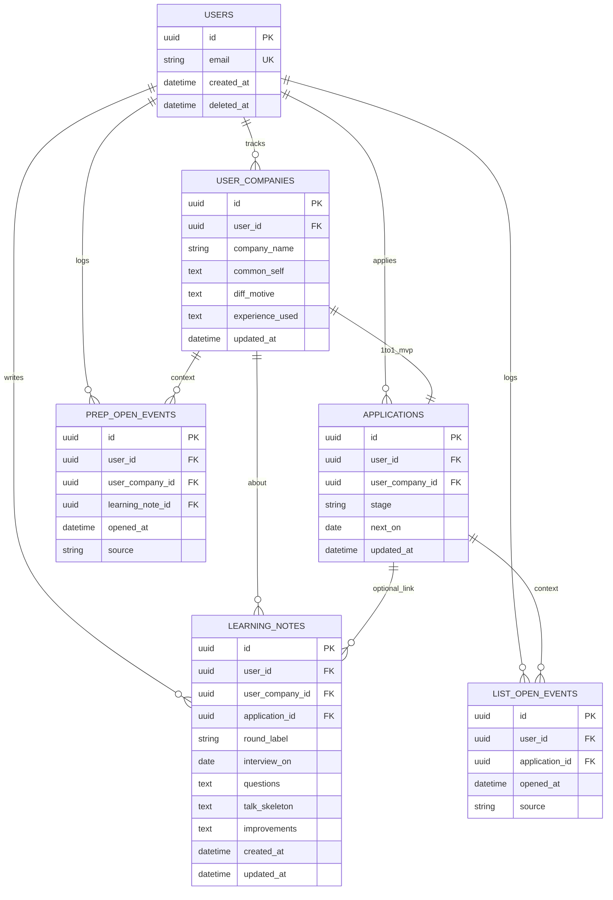

# Schema Spec (DB設計)

> **状態: LOCKED** — 2026-08-21（再LOCK）。**B＝実装先行**。検証4表に加え **F4（applications）＋一覧観測** を本論へ昇格済み。深さ＝**通常23（Must充足）**。巨大完成形は延期のまま。

完成DB百科ではない。**ERがある ≠ 検証済み**。永続の正は PostgreSQL のみ。

## 🎯 このドキュメントの結論

> **入口**: 主DB＝**PostgreSQL**。[FACT]（決裁）
>
> **永続するMust**: **F4選考一覧**／**F1学び**／**F2企業×自分**／**F3参照に必要な関係**／**V1・V3観測イベント**。[INFERENCE]
>
> **Schema Spec**: ⚠️ **WARNING** — Must関係は落ちる。PGバージョン・保持日数・認証テーブル詳細は `[UNKNOWN]`。

> [!WARNING]
> 旧巨大ERの全面移植はしない。延期表は付録／旧15参照。

> [!IMPORTANT]
> 学校に本文を出すテーブルは作らない（17）。

---

## 🚪 入口判定

| 項目 | 内容 | ラベル |
| ---- | ---- | ------ |
| 主DB採用 | **Yes（PG）** | [FACT] |
| 深さ | **通常23（Must充足）** — F4+F1–F3＋観測。完成系・巨大ERは延期 | [INFERENCE] |
| PGバージョン | **[UNKNOWN]**（マネージド） | [UNKNOWN] |

---

## 📌 引用

| 出典 | 23で使う要点 | ラベル |
| ---- | ------------ | ------ |
| **13** LOCKED | Must＝F4+F1–F3。V1/V3計測 | [HYPOTHESIS] |
| **20** LOCKED | S0–S3 | [HYPOTHESIS] |
| **21/22** LOCKED | PG・Server経由 | [FACT]（方針） |
| **17** LOCKED | 非共有・削除寄り | [INFERENCE] |

---

## ① ER（Must由来）

**F3**: 独立テーブルにしない。S3＝直近 LEARNING_NOTES ＋ USER_COMPANIES（＋APPLICATIONS.stage）を並べて開く。[INFERENCE]

**MVPの1:1**: 1 `user_companies` に 1 `applications`（複数パイプラインは延期）。[HYPOTHESIS]

---

## ② データモデル説明（短）

| ドメイン | 意図 | 出典 |
| -------- | ---- | ---- |
| USERS | 学生1人1行。学校共有アカウントなし | 17/10 |
| USER_COMPANIES | ユーザー×企業関係＋**F2** | 12 F2 |
| APPLICATIONS | **F4** 段階・次日付 | 13 F4／20 S0 |
| LEARNING_NOTES | **F1** | 13／20 S1 |
| PREP_OPEN_EVENTS | **V1** 次回準備で開いた | 13計測 |
| LIST_OPEN_EVENTS | **V3** 一覧／選考を開いた | 13 V3 |

---

## ③ テーブル一覧

| 物理名 | 論理 | MVP | 出典 | ラベル |
| ------ | ---- | --- | ---- | ------ |
| `users` | USERS | ✅ | 所有 | [HYPOTHESIS] |
| `user_companies` | USER_COMPANIES | ✅ | F2 | [HYPOTHESIS] |
| `applications` | APPLICATIONS | ✅ | **F4昇格** | [HYPOTHESIS] |
| `learning_notes` | LEARNING_NOTES | ✅ | F1 | [HYPOTHESIS] |
| `prep_open_events` | PREP_OPEN_EVENTS | ✅ | V1 | [HYPOTHESIS] |
| `list_open_events` | LIST_OPEN_EVENTS | ✅ | V3 | [HYPOTHESIS] |

---

## ④ カラム要点（薄い）

### users

| 列 | 型 | NULL | 制約 |
| -- | -- | ---- | ---- |
| id | UUID | NOT NULL | PK |
| email | TEXT | NOT NULL | UNIQUE |
| created_at | TIMESTAMPTZ | NOT NULL | — |
| deleted_at | TIMESTAMPTZ | NULL | 論理削除 |

### user_companies

| 列 | 型 | NULL | 制約 |
| -- | -- | ---- | ---- |
| id | UUID | NOT NULL | PK |
| user_id | UUID | NOT NULL | FK→users |
| company_name | TEXT | NOT NULL | — |
| common_self / diff_motive / experience_used | TEXT | NULL | F2 |
| updated_at | TIMESTAMPTZ | NOT NULL | — |

UK推奨: `(user_id, company_name)`。[HYPOTHESIS]

### applications（F4）

| 列 | 型 | NULL | 制約 |
| -- | -- | ---- | ---- |
| id | UUID | NOT NULL | PK |
| user_id | UUID | NOT NULL | FK→users |
| user_company_id | UUID | NOT NULL | FK→user_companies、**UNIQUE（MVP 1:1）** |
| stage | TEXT | NOT NULL | 例: `es` / `interview_1` / `final` / `offer`（自由文でも可） |
| next_on | DATE | NULL | 次日付／締切 |
| updated_at | TIMESTAMPTZ | NOT NULL | — |

### learning_notes

| 列 | 型 | NULL | 制約 |
| -- | -- | ---- | ---- |
| id | UUID | NOT NULL | PK |
| user_id | UUID | NOT NULL | FK |
| user_company_id | UUID | NOT NULL | FK |
| application_id | UUID | NULL | FK→applications（任意） |
| round_label | TEXT | NULL | — |
| interview_on | DATE | NULL | — |
| questions / talk_skeleton / improvements | TEXT | NULL | F1 |
| created_at / updated_at | TIMESTAMPTZ | NOT NULL | — |

### prep_open_events

| 列 | 型 | NULL | 制約 |
| -- | -- | ---- | ---- |
| id | UUID | NOT NULL | PK |
| user_id | UUID | NOT NULL | FK |
| user_company_id | UUID | NULL | FK |
| learning_note_id | UUID | NULL | FK |
| opened_at | TIMESTAMPTZ | NOT NULL | — |
| source | TEXT | NOT NULL | `s3_prep` / `direct_note` 等 |

### list_open_events（V3）

| 列 | 型 | NULL | 制約 |
| -- | -- | ---- | ---- |
| id | UUID | NOT NULL | PK |
| user_id | UUID | NOT NULL | FK |
| application_id | UUID | NULL | FK（一覧全体オープン時はNULL可） |
| opened_at | TIMESTAMPTZ | NOT NULL | — |
| source | TEXT | NOT NULL | `s0_list` / `s0_row` 等 |

---

## ⑤ 制約（ON DELETE）

| 親 | 子 | ON DELETE | 理由 |
| -- | -- | --------- | ---- |
| users | 各子 | CASCADE（またはアプリ順削除） | 退会で本文残さない |
| user_companies | applications | CASCADE | 関係削除に追随 |
| user_companies | learning_notes | 先にnotes削除 or CASCADE | NOT NULLのため |
| applications | list_open_events | CASCADE | 計測も個人データ |

保持7年等は **未採用**。[UNKNOWN]

INDEX候補: `applications(user_id, next_on)`、`learning_notes(user_id, interview_on)`、`*_events(user_id, opened_at)`。

---

## ⑥ 状態値

`applications.stage` は自由TEXTまたは小さいCHECK。厳密ステートマシンは延期。[HYPOTHESIS]

---

## ⑦ 延期（製品完成形・付録）

| テーブル案 | 本論 | 理由 |
| ---------- | ---- | ---- |
| companies（グローバル） | 延期 | 口コミ網羅しない |
| application_events（厚い履歴） | 延期 | list/prepで足りる |
| agents / schedule_* / calendar_* | 延期 | F7 Won't |
| interview_* / recordings / embeddings | 延期 | 録音・AI Won't |
| tasks ダッシュボード完成形 | 延期 | 管理完結リスク |
| universities / subscriptions（本文共有） | 延期 | 17。薄いシグナルのみ将来 |

詳細: 旧 [`15-database-design.md`](../../job-search-dashboard/docs/15-database-design.md)／[付録](./appendix-product-complete-target.md)。

---

## ⑧ Schema Spec判定

| 判定 | 理由 |
| ---- | ---- |
| ⚠️ **WARNING** | F4+コア+観測は関係化。認証テーブル・保持ポリシー数値は未 |

---

## ➡️ 次

| 優先 | 行動 |
| ---- | ---- |
| **1** | マイグレーション実装（P-Build） |
| **2** | 保持日数・退会手順を17と突合 |
| **3** | 認証テーブルは実装時に最小追加 |

---

## ✅ Done（23）

- [x] `applications` / `list_open_events` を本論昇格
- [x] 巨大完成形は延期維持
- [x] **ユーザー決裁**: 23 LOCK（2026-08-21）

---

## 📎 差分

- **変更**: F4・V3用テーブルを本論へ。旧「検証4表のみ」LOCK破棄。深さ表記を **通常23（Must充足）** に整合（プレイブック既定）
- **維持**: 完成系延期、学校本文テーブル禁止、巨大ER非移植
