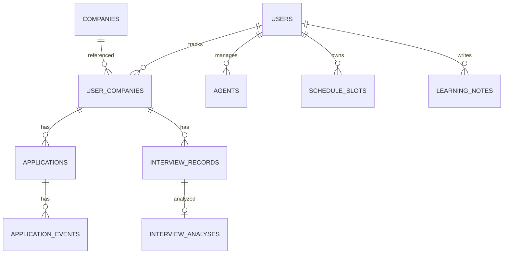

# 付録: 製品完成形ターゲット（旧 job-search-dashboard 反映）

> **状態: DRAFT（付録）** — 2026-08-21。**B＝実装先行は決裁済み**。本付録は **β／正式・巨大スキーマの完成像**。検証の正は **13／20–23**（Must＝F4+F1–F3・製品Web）。付録を引用して Must／Schema を膨らませない。

> **正の階層**: 検証 LOCK＝**13／19／20–23**。カラム百科の詳細は旧15。

## 🎯 この付録の結論

> **検証本線は決まっている:** 製品MVP相当（管理＋F1–F3）は **13 Must（F4+F1–F3・Web+PG）** として LOCK済み。本付録の仕事は **β／正式（録音・Whisper・巨大日程・完成UI）** の置き場であり、検証の正を上書きしない。

> [!WARNING]
> 11（言葉）と V1–V3（行動）を実装完了待ちでスキップするな。出荷 alone ≠ SUCCESS。

> [!IMPORTANT]
> 06 Out（マッチング本業・紹介料・音声第三者共有・管理Todo**だけ**で事業定義）は維持。完成形に管理を含めても、**差別化の芯は経験資産化**のまま。

---

## ① 旧との対応

| 旧 dashboard                                                                                                                                                       | 本付録での扱い                                                   |
| ------------------------------------------------------------------------------------------------------------------------------------------------------------------ | ---------------------------------------------------------------- |
| [05-solution-features](../../job-search-dashboard/docs/05-solution-features.md)                                                                                    | 7ドメイン＋フェーズ機能カタログを回復                            |
| [07-mvp-design](../../job-search-dashboard/docs/07-mvp-design.md)                                                                                                  | 製品MVP→β→正式の実装順を回復（**検証Mustの正は13**）             |
| [06-ui-ux-design](../../job-search-dashboard/docs/06-ui-ux-design.md)                                                                                              | 画面カタログは要約のみ（詳細は旧を参照可）                       |
| [12-technical-design](../../job-search-dashboard/docs/12-technical-design.md)／[13-system-architecture](../../job-search-dashboard/docs/13-system-architecture.md) | Whisper／AI配置／多層構成を製品ターゲットとして回復              |
| [15-database-design](../../job-search-dashboard/docs/15-database-design.md)                                                                                        | 巨大ERのエンティティ一覧を回復（カラム百科は旧を正の詳細とする） |

正ファイル側: **12**（候補）／**13** Must／**19**／**20–23**（検証実装）。

---

## ② 製品の流れ（旧05）

```text
選考管理（入口）
  → 日程調整（高頻度・実用）
  → 面接記録・分析（コア）
  → 改善・次の選考（資産化）
```

差別化: **入力自動化の深さ** と **面接経験→次行動**（旧05）。検証トラックは後者を **手入力＋F4入口**で先に壊す（13）。

---

## ③ 7ドメイン（製品カタログ・Must断定なし）

| #   | ドメイン         | やりたいこと             | 検証トラックとの関係                   |
| --- | ---------------- | ------------------------ | -------------------------------------- |
| ①   | ダッシュボード   | 今日やることを把握       | 製品β以降。検証Won't（肥大禁止）       |
| ②   | 企業管理         | 企業ごとの情報をまとめる | **F4＝検証Must（入口）**               |
| ③   | 自分管理         | 自己分析・ES・回答蓄積   | F2と接続。製品で厚く                   |
| ④   | 選考管理         | 選考状況管理             | **F4＝検証Must（入口）**               |
| ⑤   | 面接支援         | 準備・振り返り           | **F1/F3＝検証Must**。製品で録音/AI拡張 |
| ⑥   | エージェント管理 | やり取り管理             | 製品MVP+（Should寄り）                 |
| ⑦   | AIアシスタント   | 整理・生成自動化         | β／正式。検証Won't                     |

---

## ④ 製品フェーズ（旧07の実装順を回復）

**注意**: ここは **完成像カタログ**。プレイブック **13の検証Must＝F4+F1–F3（製品Web+PG）**。Concierge単独Mustではない。本付録の「製品MVP」行のうち、13に載っていない項目（深いCalendar同期・候補日エンジン等）は **本サイクル Won't／後段**。

### 製品MVP（実装カタログ・切り出し元）

| #   | 機能                   | スコープ                 | 13との関係 |
| --- | ---------------------- | ------------------------ | ---------- |
| 1   | 企業登録               | CRUD、選考段階、締切     | **F4 Must** |
| 2   | 選考段階と日程         | ステータス、日付手入力   | 日付フィールド＝Should。深いCalendar連携は後段 |
| 3   | 面接後メモ／音声登録   | 手動メモ可（AI前）       | **F1 Must**（音声はWon't） |
| 4   | 質問・回答・改善の整理 | 手作業＋簡易AI可         | **F2 Must**（簡易AIは後段） |
| 5   | 次回面接前に過去確認   | 企業別履歴＝F3の製品化   | **F3 Must** |

**製品MVP+**: エージェント管理、候補日生成、仮押さえ、講義内部管理 → 本サイクル Won't／Should。

**製品MVPに含めない（βへ）**: リアルタイム録音セッション、ブラウザWhisper、ローカルLLM、一貫性／成長分析の本実装。

### 製品β

面接セッションUX、録音、Whisper、AI分析、面接ライブラリ。AIは価値密度で Local / Cloud 分担（旧07 L1–L3）。

### 製品正式

AIコーチ、一貫性チェック、成長分析、自己分析AI、次回3分準備の自動統合。

### 旧07の開発優先（製品トラック・参考）

| 順  | 機能             | 理由             |
| --- | ---------------- | ---------------- |
| 1   | 企業・選考管理   | 入口・データ基盤 |
| 2   | 面接記録         | コア             |
| 3   | AIによる次回準備 | 差別化           |
| 4   | 候補日＋仮押さえ | 高頻度           |
| 5   | 一貫性・成長     | 正式             |

検証本サイクルの優先は **13 Mustのみ**（上表の F4+F1–F3）。

---

## ⑤ 巨大DBターゲット（旧15のエンティティ回復）

**検証用の正スキーマ**は [23-schema-spec.md](./23-schema-spec.md)（**通常23・Must充足**。applications 含む）。
以下は **製品完成形で追加するエンティティ**（カラム詳細の正は旧15）。

| フェーズ | エンティティ（論理）                                                                                                                                                                                                                                                                        |
| -------- | ------------------------------------------------------------------------------------------------------------------------------------------------------------------------------------------------------------------------------------------------------------------------------------------- |
| 製品MVP  | `COMPANIES`, `APPLICATIONS`, `APPLICATION_EVENTS`, `AGENTS`, `AGENT_CONTACTS`, `AGENT_REFERRALS`, `AGENT_SCHEDULE_PREFERENCES`, `SCHEDULE_SLOTS`, `CLASS_SCHEDULES`, `CLASS_SCHEDULE_EXCEPTIONS`, `CALENDAR_CONNECTIONS`, `TASKS`, `PROFILES`                                               |
| β        | `EPISODES`, `EPISODE_QUESTION_TYPES`, `EPISODE_COMPANY_EVALUATIONS`, `ANSWER_TEMPLATES`, `ANSWER_TEMPLATE_VARIANTS`, `INTERVIEW_RECORDS`, `INTERVIEW_TRANSCRIPTS`, `INTERVIEW_QUESTIONS`, `INTERVIEW_ANSWERS`, `INTERVIEW_ANSWER_EPISODE_LINKS`, `INTERVIEW_ANALYSES`, `RECORDING_CONSENTS` |
| 正式     | `CONSISTENCY_CHECKS`, `QUESTION_EMBEDDINGS`, `NOTIFICATIONS`, `UNIVERSITIES`, `UNIVERSITY_MEMBERSHIPS`, `SUBSCRIPTIONS`, `AI_ANALYSIS_TICKETS`, `DATA_DELETION_REQUESTS`                                                                                                                    |

設計方針（旧15から維持）:

- Single Source of Truth＝PostgreSQL
- 行は `user_id` スコープ
- 中心は「企業」ではなく **企業との関係（USER_COMPANIES）**
- 3層: 共通／ユーザー固有／AI生成（共有型口コミDBは06 Out）
- Privacy by Design: 音声はローカル優先、共有しない（17）



（検証スキーマとの関係: 23の核＋applications。上図は製品拡張。）

---

## ⑥ 技術・配置ターゲット（旧12/13）

| 領域   | 製品ターゲット（β／正式）                   | 検証トラック（現状の正） |
| ------ | ------------------------------------------- | ------------------------ |
| Client | Web＋必要なら Desktop Helper（録音）        | **製品Web（20 S0–S3）**  |
| Server | API＋ワーカー（文字起こし／AIジョブ）       | **最小API（21/22）**     |
| Data   | PostgreSQL（巨大スキーマへ拡張）            | **23 通常23（Must充足）** |
| AI     | Whisper Local、必要時 External GPT（L2/L3） | 採用なし                 |
| 非共有 | 学校・第三者に面接本文を出さない            | 同じ（17）               |

詳細構成図・ライブラリ選定の百科は旧12/13を参照。β着手時に **21/22/23を拡張再LOCK**（Must外を検証LOCKに混ぜない）。

---

## ⑦ UIターゲット（旧06・要約）

製品完成形では旧06型の面が必要になりうる: ホーム／企業・選考パイプライン／日程・仮押さえ／面接セッション／ライブラリ／設定。
**検証面の正は20（S0＋S1–S3）のまま。** 完成UIカタログは本付録＋旧06。20を完成形で上書きしない。

---

## ⑧ 実装先行ゲート（決裁済み）

| 選択肢                  | 状態 |
| ----------------------- | ---- |
| **A. 二段維持**         | 不採用 |
| **B. 実装先行**         | **決裁済み（2026-08-21）** — 13/19/12/18/20–23 再LOCK済 |

追加決裁は不要。本付録を LOCK するかどうかだけが残作業（任意）。

---

## ➡️ 次

| 優先   | 行動                                             |
| ------ | ------------------------------------------------ |
| **1**  | **P-Build**（13 Must）＋**11実施**並行           |
| **2**  | 必要なら本付録を LOCK（β／正式の置き場として）   |
| **3**  | β着手時のみ: 21/22/23を巨大スキーマ向けに拡張更新 |

---

## ✅ Done（付録DRAFT）

- [x] 旧05/07/15中心の完成形・巨大DB・実装順を回復
- [x] 検証Must（F4+F1–F3 Web）と混同しないガード
- [x] B決裁後の状態に本文を整合（Concierge本線記述を削除）
- [ ] ユーザー決裁: 付録LOCK（任意）
