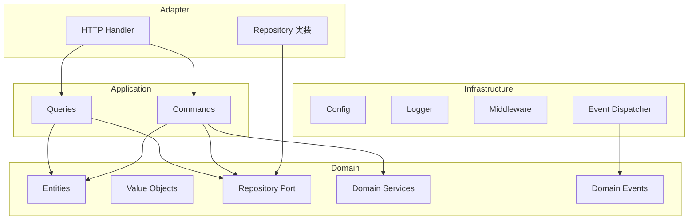
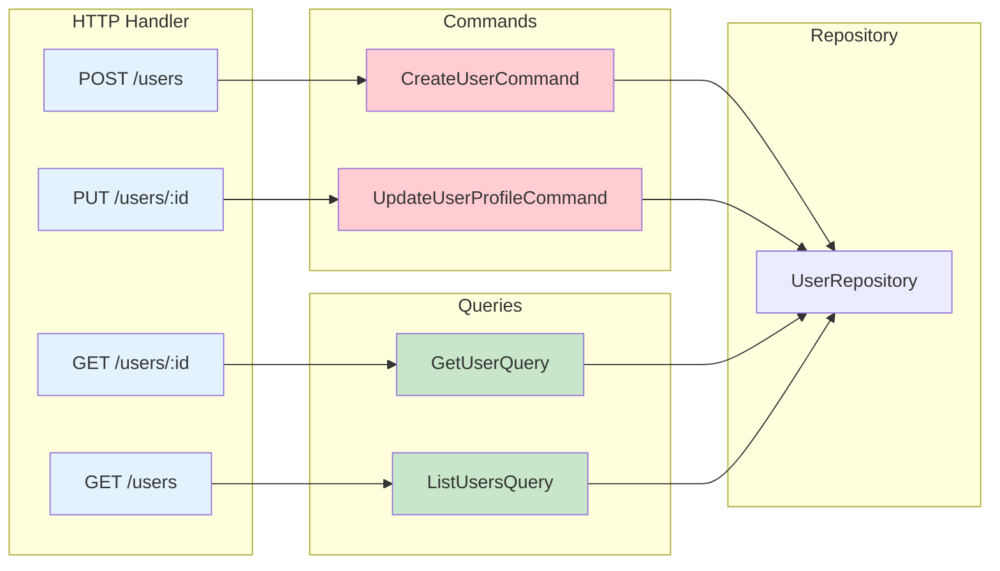
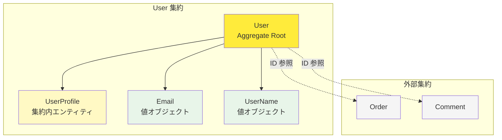
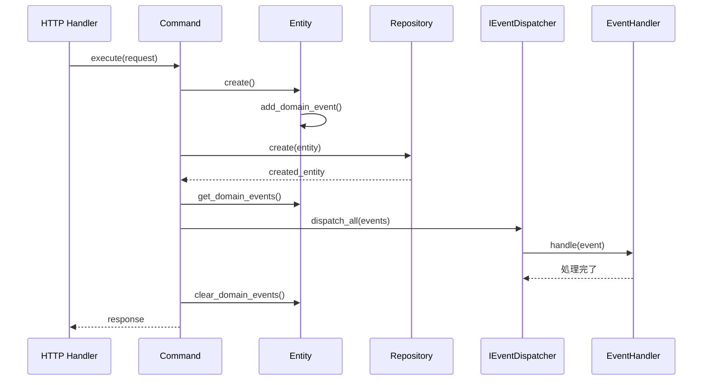
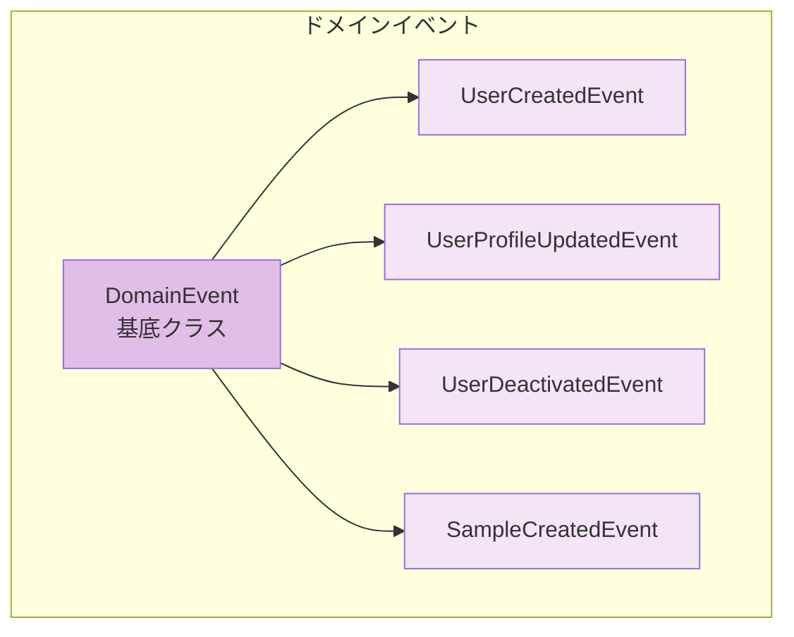
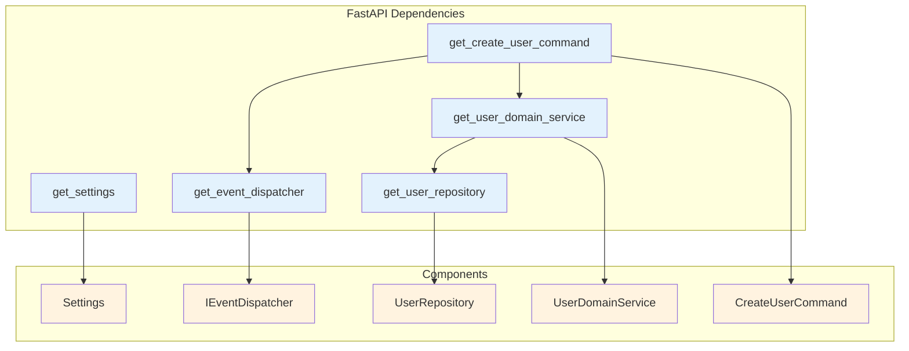
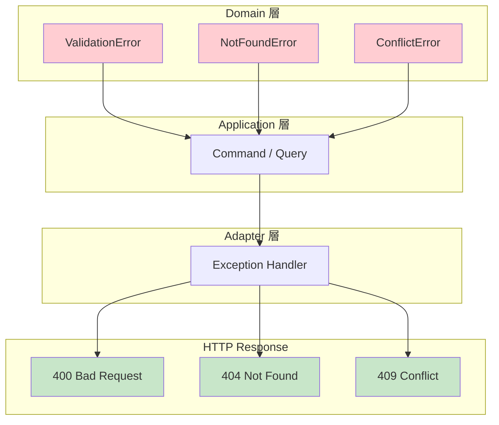
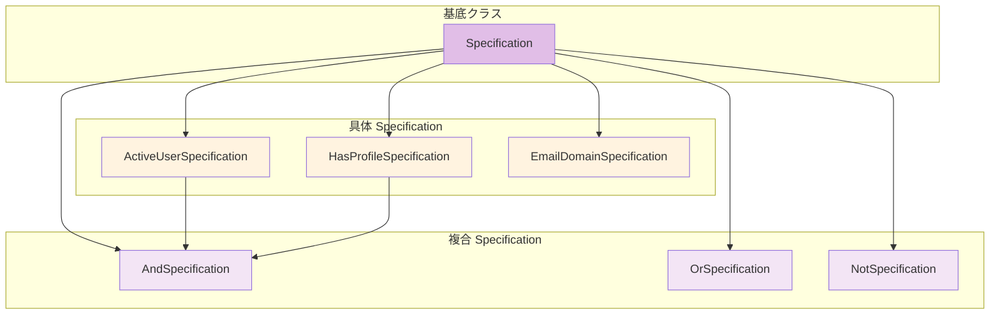

# アーキテクチャガイド

このドキュメントでは、FastAPI サーバーテンプレートの Pragmatic Clean Architecture（Vertical Slice）を視覚的に説明します。

---

## 1. 依存関係の方向



| レイヤー | 依存先 | 説明 |
| --- | --- | --- |
| Adapter | Application, Domain | HTTP と永続化の入口 |
| Application | Domain | コマンド / クエリ |
| Domain | なし | 純粋なビジネスロジック |
| Infrastructure | Domain のポートのみ | 設定・ログ・DB 接続 |

---

## 2. CQRS パターン

### コマンドとクエリの分離



### コマンドとクエリの特性

| 種類    | 特性             | 例                     |
| ------- | ---------------- | ---------------------- |
| Command | 状態を変更する   | Create, Update, Delete |
| Query   | 状態を変更しない | Get, List, Search      |

---

## 3. Aggregate Root と集約

### User 集約の構造



### 集約のルール

1. **Aggregate Root を通じてのみアクセス**: `User.update_profile()` を使用
2. **外部集約は ID で参照**: `customer_id: str` のように
3. **1 トランザクション = 1 集約**: 集約間の整合性は結果整合性

---

## 4. ドメインイベントフロー

### イベントの発行と処理



### イベントの種類



---

## 5. 依存性注入

### 依存関係の解決



---

## 6. ディレクトリ構造

```text
fastapi-server/
├── src/
│   ├── main.py                 # エントリポイント
│   ├── bootstrap/              # FastAPI 組み立て・ルーター集約
│   ├── modules/<context>/      # health / sample / user
│   │   ├── domain/
│   │   ├── application/
│   │   ├── adapters/http/
│   │   ├── infrastructure/
│   │   └── public/
│   ├── adapter/
│   │   ├── http/               # DI（dependencies.py）とミドルウェア入口
│   │   └── repository/         # Port の具象（当面インメモリ）
│   ├── infrastructure/         # config / logger / middleware / events / db
│   └── shared/                 # 共通エラー・イベントポート・HTTP 例外ハンドラ
└── alembic/                    # DB マイグレーション
```

新機能は `src/modules/<context>/` に追加し、`src/bootstrap/router_registry.py` で `/api` 配下に登録します。

---

## 7. エラーハンドリングフロー

### エラーの伝播と変換



---

## 8. Specification パターン

### 複合 Specification



### 使用例

```python
# アクティブで完全なプロファイルを持つユーザー
spec = (
    ActiveUserSpecification()
    & HasCompleteProfileSpecification()
    & EmailDomainSpecification("company.com")
)

matching_users = [u for u in users if spec.is_satisfied_by(u)]
```

---

## まとめ

このテンプレートは以下の DDD パターンを実装しています：

1. **Pragmatic Clean Architecture（Vertical Slice）**: コンテキスト単位で依存関係の方向を厳密に管理
2. **CQRS**: コマンドとクエリの分離
3. **Aggregate Root**: 集約の境界と整合性
4. **ドメインイベント**: イベント駆動アーキテクチャ
5. **Specification パターン**: 再利用可能なビジネスルール
6. **依存性注入**: テスト容易性と柔軟性
