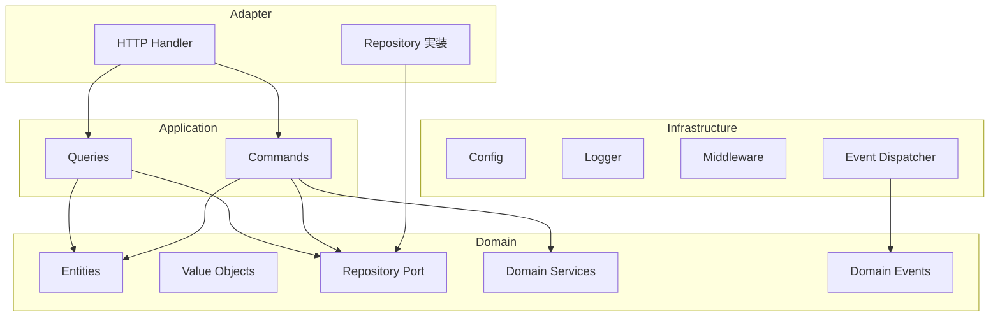
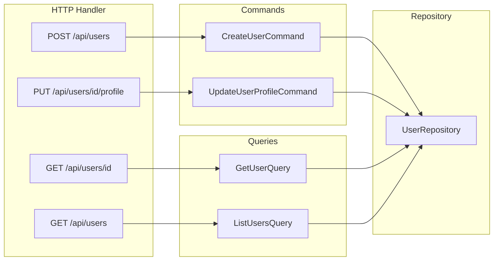

# アーキテクチャガイド

このドキュメントでは、Go サーバーテンプレートの Pragmatic Clean Architecture（Vertical Slice）を説明します。

---

## 1. 依存関係の方向



| レイヤー | 依存先 | 説明 |
| --- | --- | --- |
| Adapter | Application, Domain | HTTP と永続化の入口 |
| Application | Domain | コマンド / クエリ |
| Domain | なし | 純粋なビジネスロジック |
| Infrastructure | Domain のポートのみ | 設定・ログ・DB 接続 |

---

## 2. ディレクトリ構成

```text
go-server/
├── cmd/api/                 # エントリポイント
├── cmd/migrate/             # goose マイグレーション
├── internal/
│   ├── bootstrap/           # 手動 DI と HTTP 組み立て
│   ├── modules/<context>/   # health / sample / user
│   │   ├── domain/
│   │   ├── application/
│   │   ├── adapters/http/
│   │   ├── infrastructure/
│   │   └── public/
│   ├── adapter/repository/  # Port の具象（当面インメモリ）
│   ├── infrastructure/      # config / logger / middleware / db
│   └── shared/              # 共通エラー・イベント・HTTP ヘルパー
└── migrations/              # goose SQL
```

新機能は `internal/modules/<context>/` に追加し、`internal/bootstrap/server.go` で `/api` 配下に登録します。

---

## 3. CQRS



| 種類 | 特性 | 例 |
| --- | --- | --- |
| Command | 状態を変更する | Create, Update, Deactivate |
| Query | 状態を変更しない | Get, List |

---

## 4. HTTP 契約

| Method | Path | 説明 |
| --- | --- | --- |
| GET | `/health` | ヘルスチェック（prefix なし） |
| GET/POST | `/api/samples` | サンプル一覧 / 作成 |
| GET | `/api/samples/{id}` | サンプル取得 |
| GET/POST | `/api/users` | ユーザー一覧 / 作成 |
| GET | `/api/users/{id}` | ユーザー取得 |
| PUT | `/api/users/{id}/profile` | プロファイル更新 |
| DELETE | `/api/users/{id}` | 非アクティブ化 |

ドメインエラーは `shared/http` で HTTP ステータスへ変換します（400 / 404 / 409 / 500）。

---

## 5. 永続化

sample / user のリポジトリ実装は当面インメモリです。PostgreSQL は `DATABASE_URL` で接続確認し、goose で初期スキーマを適用します。差し替えるときは `internal/adapter/repository/` に pgx 実装を追加し、`bootstrap` の組み立てだけを変更します。
